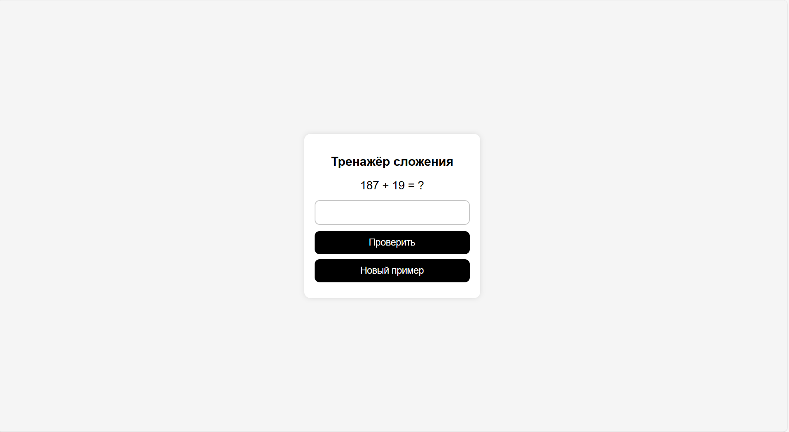
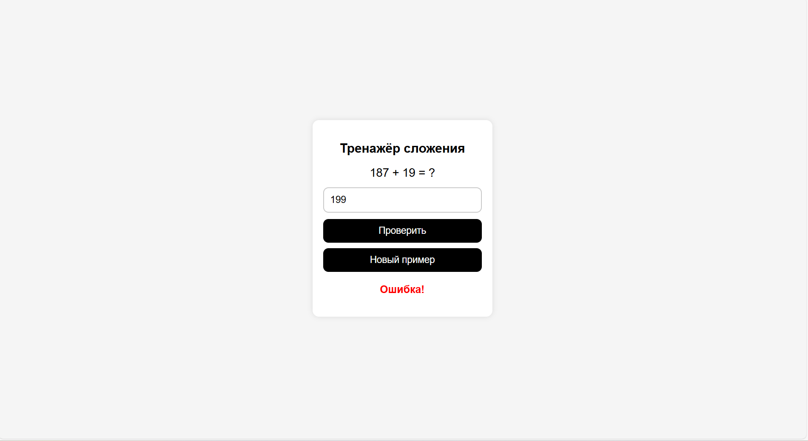
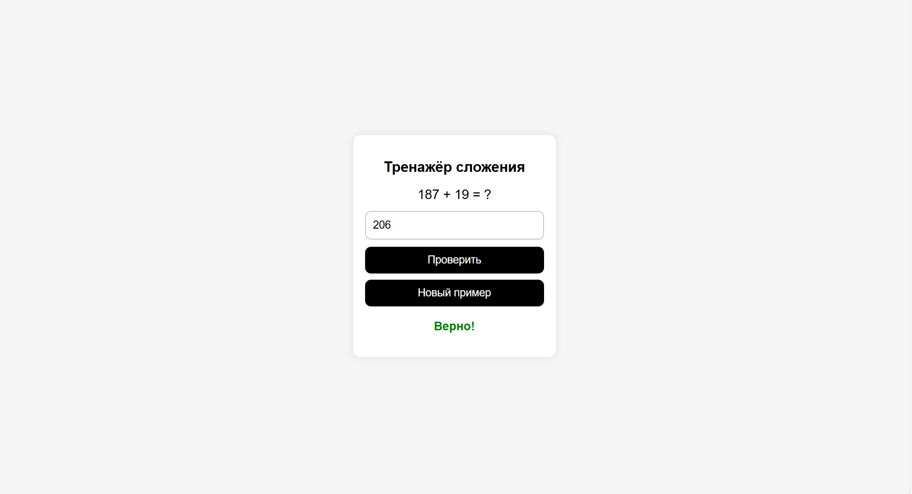
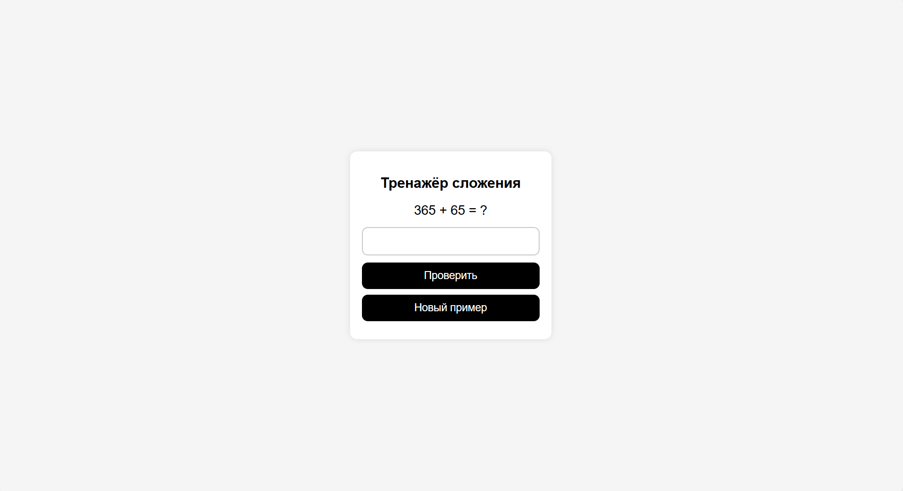

# Math Trainer

Простой тренажёр на сложение чисел.

## Функции
- Генерация случайных примеров
- Ввод ответа
- Проверка правильности
- Кнопка нового примера 

## Скриншоты работы

### Главная страница

### Работоспособность 

#### Ошибка

#### Верное решение

#### Новый пример

## Итог

В рамках 4 контрольной работы был создан математический тренажер на сложение.
Данная работа помогла мне лучше понять как правильно структуривовать React-проекты, а также помогла укрепить уже полученные знания.